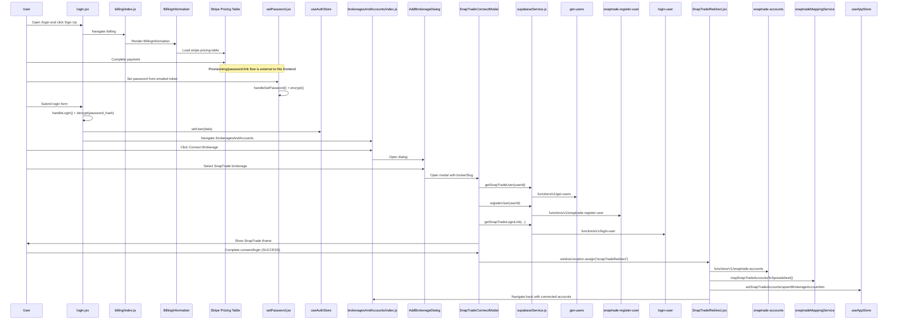
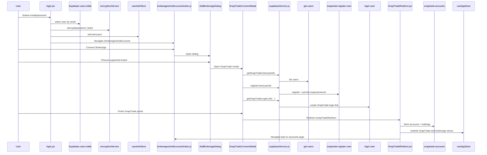

# Login + SnapTrade Workflow (Detailed)

This document describes the **actual runtime flow** in this codebase for login and brokerage connection, including which files and functions are executed.

## Scope and Important Notes

- The app has two main user paths relevant here:
  - **Workflow #1:** user has never paid for the Stock Owner Report, then pays, then connects via SnapTrade.
  - **Workflow #2:** user has already paid, logs in first, then connects via SnapTrade.
- Payment capture is rendered through Stripe Pricing Table in the frontend (`src/layouts/billing/components/BillingInformation/index.js`), but the full Stripe webhook/backend provisioning code is not present in this repository.
- This repo **does** show how password setup/login and SnapTrade connect are executed end-to-end.

---

## Core Files Involved

### Routing and App Boot
- `src/index.js`
  - `ReactDOM.createRoot(...).render(...)` wraps app in `BrowserRouter` + `CustomControllerProvider`.
- `src/App.js`
  - `supabase.auth.getSession()` in `getSession()`.
  - `supabase.auth.onAuthStateChange(...)` listener.
  - `useAuthStore.setUser(...)` to hydrate auth state.
  - Route rendering via `routes` from `src/routes.js`.
- `src/routes.js`
  - `/billing` -> `layouts/billing/index.js`.
  - `/login` -> `layouts/login/login.jsx`.
  - `/brokeragesAndAccounts` -> wrapped by `RequireAuth`.
  - `/balanceSheet`, `/incomeStatement` -> wrapped by `RequireAuth` + `RequireBrokerageConnected`.
  - `/snapTradeRedirect` -> `layouts/SnapTradeRedirect.jsx`.

### Auth and Guards
- `src/stores/useAuthStore.js`
  - `setUser(user)`
  - `clearUser()`
  - persisted fields: `user`, `snapUserSecret`, `isAuthenticated`.
- `src/components/RequireAuth.jsx`
  - redirects to `/login` if `isAuthenticated` is false.
- `src/components/RequireBrokerageConnected.jsx`
  - redirects to `/brokeragesAndAccounts` unless account data exists.

### Login and Password Setup
- `src/layouts/login/login.jsx`
  - `handleLogin(e)`
  - Supabase query: `supabase.from("users").select("*").eq("email", email).single()`
  - password compare via `decrypt(data.password_hash)` from `src/services/encryptionService.js`
  - success path: `setUser(data)` then `navigate("/brokeragesAndAccounts")`.
- `src/layouts/sendPasswordReset/sendPasswordReset.jsx`
  - `handleSend()` calls Edge Function `send-password-reset-link-email`.
- `src/layouts/setPassword/setPassword.jsx`
  - validates reset token in `password_reset_tokens`
  - `encrypt(password)`
  - updates `users.password_hash`
  - deletes used token and redirects to `/login`.
- `supabase/functions/send-password-reset-link-email/index.ts`
  - sends reset email (via Resend) and obtains link from `send_password_setup_link` function.

### Billing
- `src/layouts/billing/index.js`
  - renders billing page and `BillingInformation`.
- `src/layouts/billing/components/BillingInformation/index.js`
  - injects Stripe script (`https://js.stripe.com/v3/pricing-table.js`)
  - renders `<stripe-pricing-table ...>` from env vars.

### Brokerage Connect (UI + Services)
- `src/layouts/brokeragesAndAccounts/index.js`
  - page users land on after login.
  - `handleOpen()` opens `AddBrokerageDialog`.
- `src/layouts/brokeragesAndAccounts/AddBrokerageDialog.js`
  - `handleBrokerageTileClick(...)`
  - opens `SnapTradeConnectModal` for allowlisted brokerages.
  - callbacks: `handleSnapTradeSuccess`, `handleSnapTradeError`, `handleSnapTradeExit`.
- `src/layouts/brokeragesAndAccounts/SnapTradeConnectModal.js`
  - `handleSnapTradeAuth()` orchestrates SnapTrade registration/login link.
  - listens for `window.postMessage` success/error/close from iframe.
  - on success: `window.location.assign("/snapTradeRedirect")`.
- `src/services/supabaseService.js`
  - `getSnapTradeUser(userId)` -> Edge Function `get-users`
  - `registerUser(userId, options)` -> Edge Function `snaptrade-register-user`
  - `getSnapTradeLoginLink(userId, userSecret, redirectURI, options)` -> Edge Function `login-user`.

### SnapTrade Redirect + Store Hydration
- `src/layouts/SnapTradeRedirect.jsx`
  - `fetchSnapTradeAccounts(userId, userSecret)` invokes Edge Function `snaptrade-accounts`
  - maps result via `mapSnapTradeAccountsToSpreadsheet(...)`
  - updates app store:
    - `setSnapTradeAccounts(...)`
    - `setSnapTradeHoldings(...)`
    - `upsertBrokerageAccount(...)`
    - `setAccountHoldingsForAccount(...)`
    - `setAccountHoldings(...)`
  - then `navigate("/brokeragesAndAccounts")`.
- `src/services/snaptradeMappingService.js`
  - `mapSnapTradeAccountsToSpreadsheet(accounts)`

### SnapTrade Edge Functions
- `supabase/functions/get-users/index.ts`
  - SnapTrade SDK call: `authentication.listSnapTradeUsers()`.
- `supabase/functions/snaptrade-register-user/index.ts`
  - SnapTrade SDK calls:
    - optional `authentication.deleteSnapTradeUser(...)`
    - `authentication.registerSnapTradeUser(...)`
  - stores `snapusersecret` in `users` table.
- `supabase/functions/login-user/index.ts`
  - reads `users.snapusersecret`
  - SnapTrade SDK call: `authentication.loginSnapTradeUser(...)`
  - returns redirect/login link.
- `supabase/functions/snaptrade-accounts/index.ts`
  - SnapTrade SDK calls:
    - `accountInformation.listUserAccounts(...)`
    - per account: `getUserHoldings(...)` and `getUserAccountDetails(...)`
  - returns merged accounts+holdings payload.

---

## Workflow #1: Never Paid -> Pays -> Then Connects SnapTrade

### Step-by-step execution

1. User opens signup path from login page (`/login` -> “Sign Up” link).
   - File: `src/layouts/login/login.jsx`
   - Link target: `/billing`

2. Billing page loads and renders Stripe Pricing Table.
   - File: `src/layouts/billing/index.js`
   - Component: `BillingInformation`
   - File: `src/layouts/billing/components/BillingInformation/index.js`
   - Runtime actions:
     - `useEffect(...)` injects Stripe script.
     - `<stripe-pricing-table ...>` rendered with env IDs.

3. Payment completion + account provisioning happens outside this frontend flow.
   - Inferred data model support exists in:
     - `supabase/Database Scripts/InitializationScripts.sql` (`users.is_subscribed`, `last_payment_at`, etc.)
   - Password setup/reset path uses:
     - Edge Function `send-password-reset-link-email`
     - `password_reset_tokens` table
     - page `src/layouts/setPassword/setPassword.jsx`.

4. User sets password (first-time) and then logs in.
   - Files/functions executed:
     - `src/layouts/setPassword/setPassword.jsx` -> `handleSetPassword()` -> `encrypt(password)` -> update `users.password_hash`.
     - `src/layouts/login/login.jsx` -> `handleLogin(e)` -> fetch `users` row -> `decrypt(password_hash)` -> compare -> `setUser(data)` -> `navigate('/brokeragesAndAccounts')`.

5. User clicks **Connect Brokerage**.
   - File: `src/layouts/brokeragesAndAccounts/index.js`
   - `handleOpen()` opens `AddBrokerageDialog`.

6. User picks a SnapTrade-supported brokerage.
   - File: `src/layouts/brokeragesAndAccounts/AddBrokerageDialog.js`
   - `handleBrokerageTileClick(broker)`
   - opens `SnapTradeConnectModal` with broker slug.

7. SnapTrade auth orchestration runs.
   - File: `src/layouts/brokeragesAndAccounts/SnapTradeConnectModal.js`
   - Function: `handleSnapTradeAuth()`
   - Calls service methods in order:
     1) `supabaseService.getSnapTradeUser(userId)`
     2) `supabaseService.registerUser(userId, { force: ... })`
     3) save `userSecret` to auth store + `users.snapusersecret`
     4) `supabaseService.getSnapTradeLoginLink(userId, userSecret, redirectURI, { broker, connectionPortalVersion: 'v4' })`
   - Renders iframe with returned login link.

8. On iframe success, app redirects to SnapTrade redirect route.
   - In modal message handler:
     - status `SUCCESS` -> `window.location.assign('/snapTradeRedirect')`

9. Redirect page fetches and stores SnapTrade accounts/holdings.
   - File: `src/layouts/SnapTradeRedirect.jsx`
   - `fetchSnapTradeAccounts(userId, userSecret)` -> Edge Function `snaptrade-accounts`
   - `mapSnapTradeAccountsToSpreadsheet(...)`
   - store updates (`setSnapTradeAccounts`, `upsertBrokerageAccount`, etc.)
   - navigate back to `/brokeragesAndAccounts`.

### Mermaid diagram (Workflow #1)

---

## Workflow #2: Already Paid -> Logs In First -> Then Connects SnapTrade

### Step-by-step execution

1. User opens `/login` and submits credentials.
   - File: `src/layouts/login/login.jsx`
   - Function: `handleLogin(e)`
   - Calls:
     - `supabase.from('users').select('*').eq('email', email).single()`
     - `decrypt(data.password_hash)`
     - success -> `useAuthStore.setUser(data)` and `navigate('/brokeragesAndAccounts')`

2. Protected routing is satisfied.
   - `RequireAuth` passes because `isAuthenticated` is true.
   - User reaches `src/layouts/brokeragesAndAccounts/index.js`.

3. User initiates brokerage connection.
   - `handleOpen()` -> `AddBrokerageDialog`
   - `handleBrokerageTileClick(...)` -> `SnapTradeConnectModal`

4. SnapTrade connect flow executes (same as Workflow #1).
   - `handleSnapTradeAuth()` in `SnapTradeConnectModal.js`
   - service calls:
     - `getSnapTradeUser`
     - `registerUser`
     - `getSnapTradeLoginLink`
   - iframe success -> `/snapTradeRedirect`

5. Redirect route fetches accounts and hydrates store.
   - `SnapTradeRedirect.jsx`:
     - `fetchSnapTradeAccounts(...)`
     - `mapSnapTradeAccountsToSpreadsheet(...)`
     - `setSnapTradeAccounts`, `setSnapTradeHoldings`, `upsertBrokerageAccount`, `setAccountHoldingsForAccount`, `setAccountHoldings`
   - returns to `/brokeragesAndAccounts` with connected data.

### Mermaid diagram (Workflow #2)

---

## “What executes” quick index (by action)

- **Login submit**
  - `login.jsx` -> `handleLogin` -> Supabase users query -> `decrypt` -> `setUser` -> `navigate`.
- **Open connect dialog**
  - `brokeragesAndAccounts/index.js` -> `handleOpen` -> `AddBrokerageDialog`.
- **Choose SnapTrade brokerage**
  - `AddBrokerageDialog.js` -> `handleBrokerageTileClick` -> open `SnapTradeConnectModal`.
- **SnapTrade session init**
  - `SnapTradeConnectModal.js` -> `handleSnapTradeAuth` -> `supabaseService.getSnapTradeUser/registerUser/getSnapTradeLoginLink` -> Edge Functions.
- **Post-consent account sync**
  - `SnapTradeRedirect.jsx` -> `fetchSnapTradeAccounts` -> `mapSnapTradeAccountsToSpreadsheet` -> Zustand updates.
